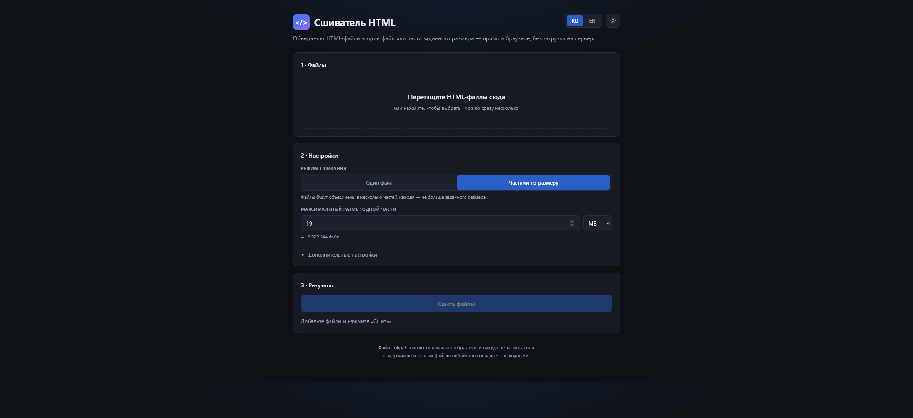

# 🧵 Сшиватель HTML

**[English](./README.en.md)** | Русский

Объединяет HTML-файлы в один файл или части заданного размера — прямо в браузере, без загрузки на сервер.

**[Открыть приложение →](https://ваш-домен/)**

## Возможности

- **Два режима** — один итоговый файл или части с лимитом размера (МБ/КБ/байт);
  крупные файлы не режутся, а попадают в отдельную часть целиком
- **Всё локально** — файлы не покидают ваш компьютер, сеть не используется
- **Ведущие нули** — при 10+ частей имена идут как `total_01.html`, чтобы порядок не ломался при сортировке
- **ZIP одним архивом** — собирается прямо в браузере, без библиотек (DEFLATE через CompressionStream)
- **SHA-256** — контрольные суммы каждой части + манифест, совместимый с `sha256sum -c`
- **Предпросмотр** — итог открывается в новой вкладке до скачивания
- **Порядок файлов** — перетаскивание мышью и кнопки ↑ ↓ с клавиатуры
- **Web Worker** — тяжёлая работа в фоновом потоке: интерфейс не подвисает на гигабайтах
- **Прогресс и отмена** — полоса с процентами, операцию можно прервать
- **Виртуализация списка** — тысячи файлов без тормозов
- **RU / EN интерфейс, светлая и тёмная темы** — выбор запоминается
- **Доступность** — разметка и контраст по WCAG 2.1 AA

## Использование

1. Перетащите `.html`-файлы в зону загрузки (или кликните для выбора)
2. Выберите режим: «Один файл» или «Частями по размеру»
3. Нажмите «Сшить» → скачайте результат по отдельности или ZIP-архивом

## Самостоятельный деплой

1. Сделайте **Fork** этого репозитория
2. **Settings → Pages → Deploy from a branch → main / (root) → Save**
3. Через минуту сайт доступен по адресу `https://ВАШ_ЛОГИН.github.io/html-stitcher/`

Приложение — один файл `index.html` без зависимостей, сборка не нужна.

## Технические детали

| | |
|---|---|
| Зависимости | нет — один самодостаточный `index.html` |
| Сшивание | побайтовая конкатенация, результат идентичен исходникам |
| ZIP | собственная реализация формата (STORE + DEFLATE при наличии CompressionStream) |
| Хеши | `crypto.subtle.digest` SHA-256 |
| Фоновые операции | Web Worker, собираемый из inline-Blob (с фолбэком в main thread) |
| Требования | HTTPS или `file://` (для SHA-256 нужен secure context) |

## Совместимость

Полная функциональность (сжатие ZIP, SHA-256): Chrome/Edge 103+, Firefox 113+, Safari 16.4+.
В старых браузерах работает всё, кроме сжатия ZIP и контрольных сумм.

## Происхождение

Инструмент вырос из небольшого Python-скрипта, склеивающего HTML-файлы по 19 МБ.
Логика разбиения сохранена 1:1, но всё переехало в браузер.

## Лицензия

[MIT](./LICENSE)